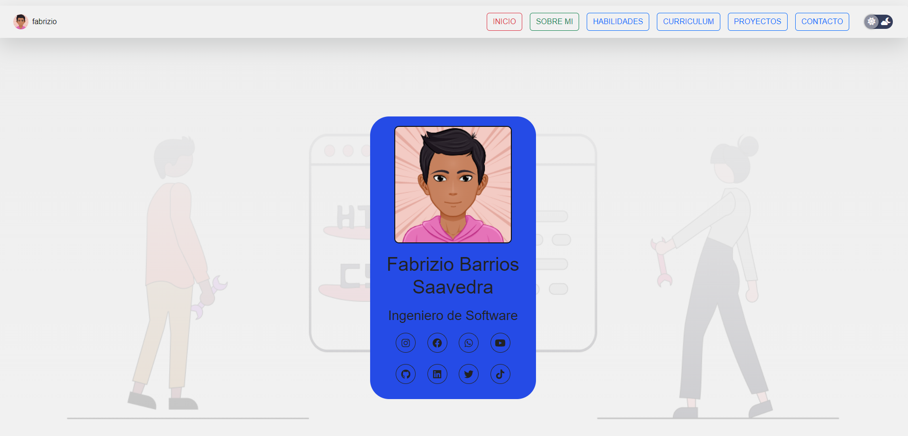
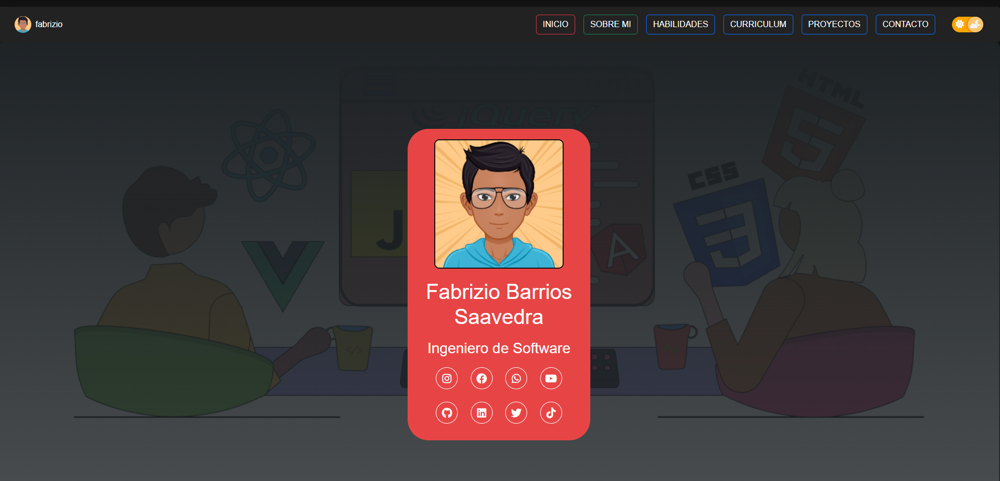
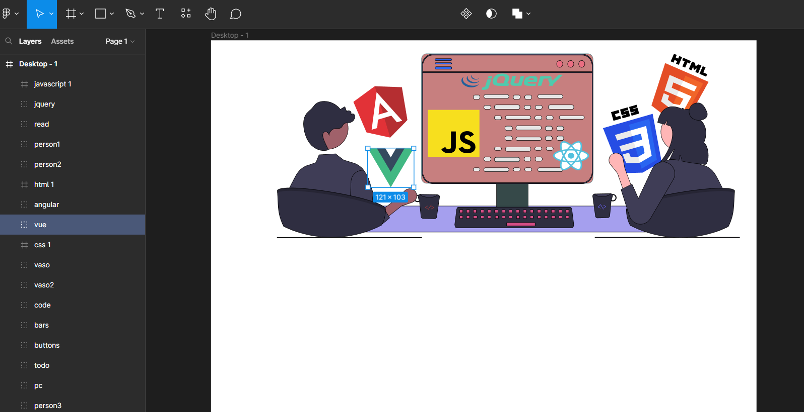

<h4>Mi portafolio Personal Esta Casi Listo</h4>
<h4>Lenguajes Utilizados:</h4>

<h4 class="py-3">HTML</h4>
<h4 class="py-3">Sass</h4>
<h4 class="py-3">CSS</h4>
<h4 class="py-3">BOOTSTRAP</h4>
<h4 class="py-3">FONT AWESOME</h4>
<h4 class="py-3">unDraw</h4>
<h4 class="py-3">FIGMA</h4>
<h4 class="py-3">FLATICON</h4>
 
Puedes Visualizarlo en los siguientes enlaces: 
<h3 class="py-4">GITHUB</h3>
<a href="https://fabriziobarriossaavedra.github.io/repositorio.com" title="Ver Proyecto rounded-3">🙂 GIT HUB</a>

<h3 class="py-4">VERCEL</h3>
<a href="https://repositorio-com.vercel.app" title="Ver Proyecto">🙂 VERCEL APP</a>    

<h4 class="py-3">por el momento esta en mantenimiento ;)</h4>

<h4>FIGMA</h4>

<h1>Pronto Nueva App de Escritorio</h1>
<h4>Preview</h4>

<h3><b>Realizado por:</b> Fabrizio Barrios Saavedra (RFBS19)</h3>
